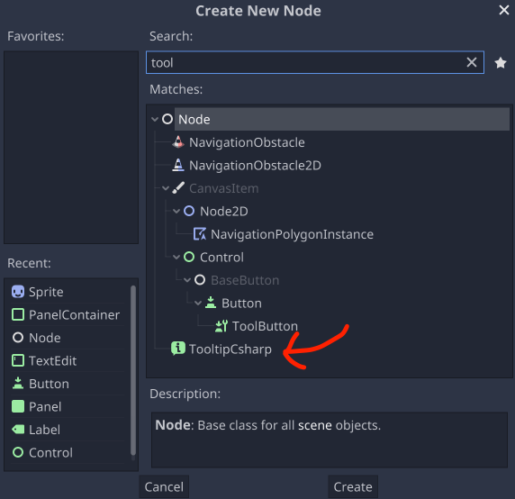
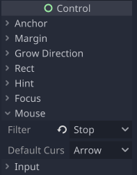
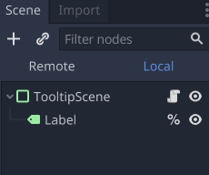

# TooltipCSharp for Godot 3.x

A C# port of the Modular-tooltip by IndieQuest. I made some changes for my needs and also made it an addon for Godot Mono.

Original GD code by IndieQuest : https://github.com/IndieQuest/Modular-tooltip

__The examples are made with Godot 3.5 and wont work on 3.4__

# Installation
- Copy `addons/TooltipCsharp` into your project (final path should be `res://addons/TooltipCsharp`).

- Build your project ( for a new project, go to `'Project'->'tools'->'C#'-> 'make solution'`, else click the `'build'` button on the top right of the Godot IDE)

- Enable the pugin in `'Project'->'Project settings'-> 'plugin'` tab and check the `'enable'` checkbox. 

_If you have an error message here, try rebuilding the project._

# Usage

1. Add a TooltipCsharp node on any **Control** node of your scene

The Node **MUST** be of type **Control** or one of its children. This is because the Control nodes all have *Mouse_entered()* and *mouse_exited()* signals and the tooltip relies on both of these...

If you realy want to put a Tooltip on anything else, you'll have to implement those signals.



2. Set the **Mouse Filter** of your parent node to **Stop** so the mouse is not ignored



3. Set the **Visual Res** and **Owner Path** of your TooltipCsharp Node.

- **Visual Res** is a scene of your tooltip, the root node of this scene __*MUST*__ be a Node of type **Control** or one of its children and have a script implementing the ITooltip interface (see the TooltipScene.tscn in the example folder).



- **Owner Path** is the parent of your TooltipCsharp Node

To create a Tooltip dynamicaly you can use this static function :

```C#
 Addons.Nodes.Utils.CreateTooltipCsharp(PackedScene visualScene, Node parent);
```

Here an example :

```C#
//Create a new tooltip with a packed scene and a parent
TooltipCsharp tooltip = godot-TooltipCsharp.Utils.CreateTooltipCsharp(
    (PackedScene)ResourceLoader.Load("res://example/TooltipScene.tscn"),
     GetNode<Label>($"%Label2").GetParent());

//Add it to the parent (must be the same a below)
GetNode<Label>($"%Label2").AddChild(tooltip);
```

# Example

You'll find an example folder in the project with a Main scene with a tooltip and some example to modify it programatically.


# Limitations

1. It is currently possible to add a Tooltip on a Node of type **Control** or one of its children.

2. The Tooltip Scene muse be a Node of type **Control** or one of its children.

3. If you are on mac there is a possibility that the icon of the TooltipCsharp Node will be too small. there is a 32*32 one in the folder you can switch it if needed. 

